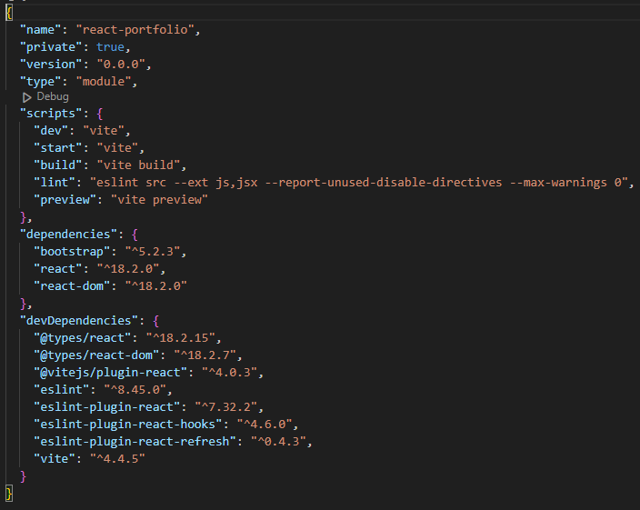
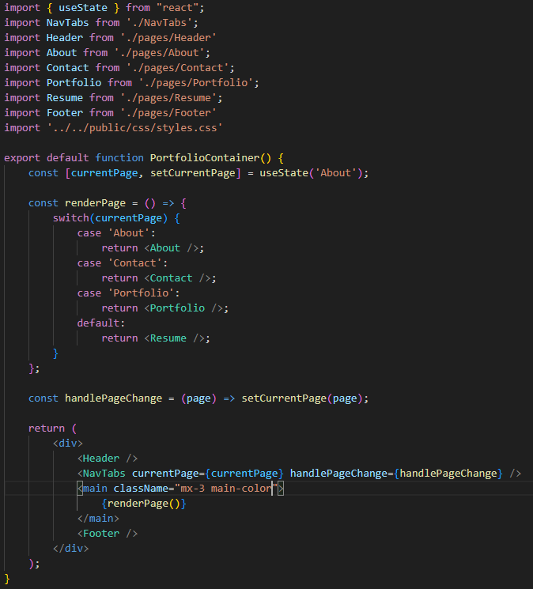
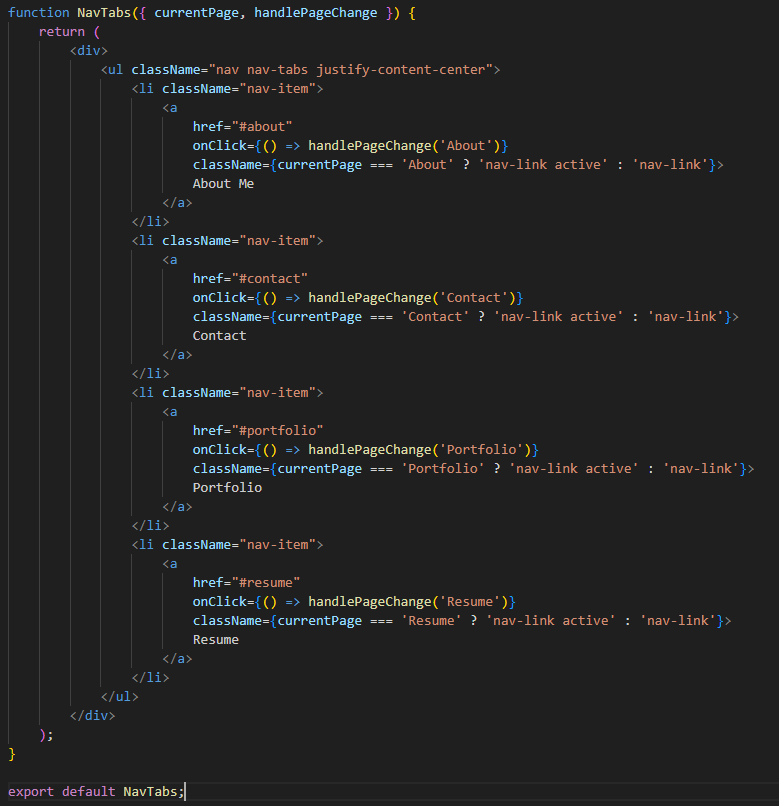
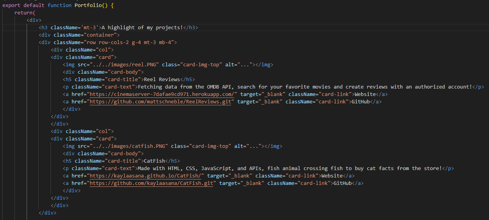

# React Portfolio

## Description

This project was built using React.js to create a portfolio where future employers can access information about me and view previous projects in one place. I was able to learn how to create an application using Vite and the flow and connection of all the files together.

Deployed link: 

## Usage

These are the required dependencies, which can be installed with a `npm install`. The scripts provided are how you can built or start the site.

Here we're importing all the pages and creating a switch case for rendering the page when the user clicks on a navigation tab. Using the react.js method of `usestate`, we can create a function that handles the page changes and renders the relevant pages.

Using the bootstrap format for navigation tabs, there is an event listener to handle the page change, talked about previously. 

This is an example of code of one of the project rows in the portfolio page. We export the function Portfolio, which is rendered when the Portfolio navigation tab is clicked. It contains a photo, title, description of the project, and a link for the deployed website and GitHub repository.

## Technologies Used

- Bootstrap Framework (https://getbootstrap.com/)
- React.js
- HTML/CSS

## Credits

- Tutor Joem Casusi